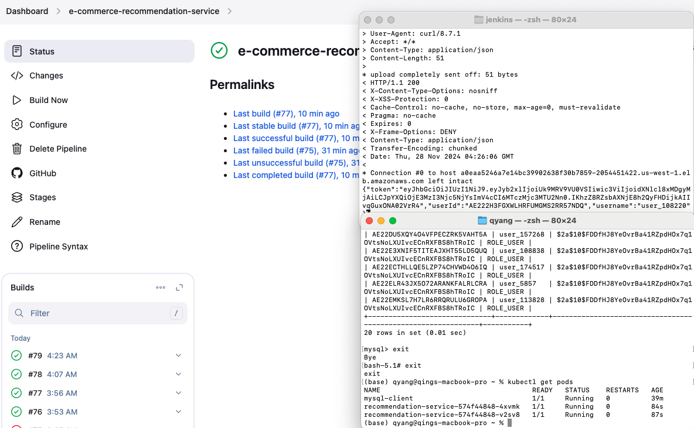

# e-commerce-recommendation-service
Spring Boot Recommendation Microservice

Please notice this implementation is focused on the backend part instead of the recommendation algorithm although it's used somewhere. Spring Boot, Security, Unit Test, Performance Test, CI/CD Jenkins, Kubernetes, and Cloud deployment are included.

### Data Source
This project utilizes data from [Amazon Review Data (2023)](https://amazon-reviews-2023.github.io/). 
Please refer to the original data source for further details.
Our subset includes 5 categories for simplicity: All_Beauty, Amazon_Fashion, Appliances, Arts_Crafts_and_Sewing, Automotive. (24.43 GB in total)

#### Write data into mysql db
    python -m venv venv

    source venv/bin/activate 

    pip install -r requirements.txt

    python process.py

### Recommendation Model(offline)
Python3.9 used since python3.11 can not install surprise. 

    python3.9 -m venv myenv39 

    source myenv39/bin/activate

    python3.9 -m pip install mysql-connector-python pandas scikit-surprise scikit-learn python-dotenv

    python3.9 -m pip install joblib tqdm psutil pyarrow faker

Besides, we sample data here since the recommendation model is not our main focus.

    python3.9 memory_efficient_training.py # to include more recommendations for users, change cursor.execute("SELECT user_id FROM users LIMIT 1000") in def def save_recommendations(self):

Need to mention, the profiles data created is fake since we do not have access to that.

### Spring Boot API
After running the api, you can access the Api Documentation:

    Swagger UI: http://localhost:8080/swagger-ui.html

    OpenAPI JSON: http://localhost:8080/v3/api-docs

#### Run the Unit Test and the Performance Test(JMeter)
    mvn verify -Pjmeter-tests

Overall Test Performance:

Total Requests: 153,229 requests completed

Total Duration: 9 minutes

Final Throughput: 284.0 requests/second

Error Rate: 0% (no errors)

Response Times: Min = 0ms, Max = 1117ms

### Jenkins Docker
go to the jenkins folder

    docker run -d \            
    --name jenkins \
    -p 8080:8080 -p 50000:50000 \
    -v jenkins_home:/var/jenkins_home \
    -v /var/run/docker.sock:/var/run/docker.sock \
    --group-add $(ls -ln /var/run/docker.sock | awk '{print $4}') \
    custom-jenkins

### AWS configuration

    aws configure  # If not already configured

    aws ecr create-repository --repository-name your-app-name --region your-region

    eksctl create cluster --name your-cluster --region your-region

    aws iam create-role --role-name jenkins-eks-role --assume-role-policy-document '{"Version":"2012-10-17","Statement":[{"Effect":"Allow","Principal":{"Service":"ec2.amazonaws.com"},"Action":"sts:AssumeRole"}]}' --region your-region

    aws iam attach-role-policy --role-name jenkins-eks-role --policy-arn arn:aws:iam::aws:policy/AmazonEKSClusterPolicy --region your-region

    ...

## Finally the eks works!!!

## Please turn of all the services you open in aws to avoid further cost!!!
